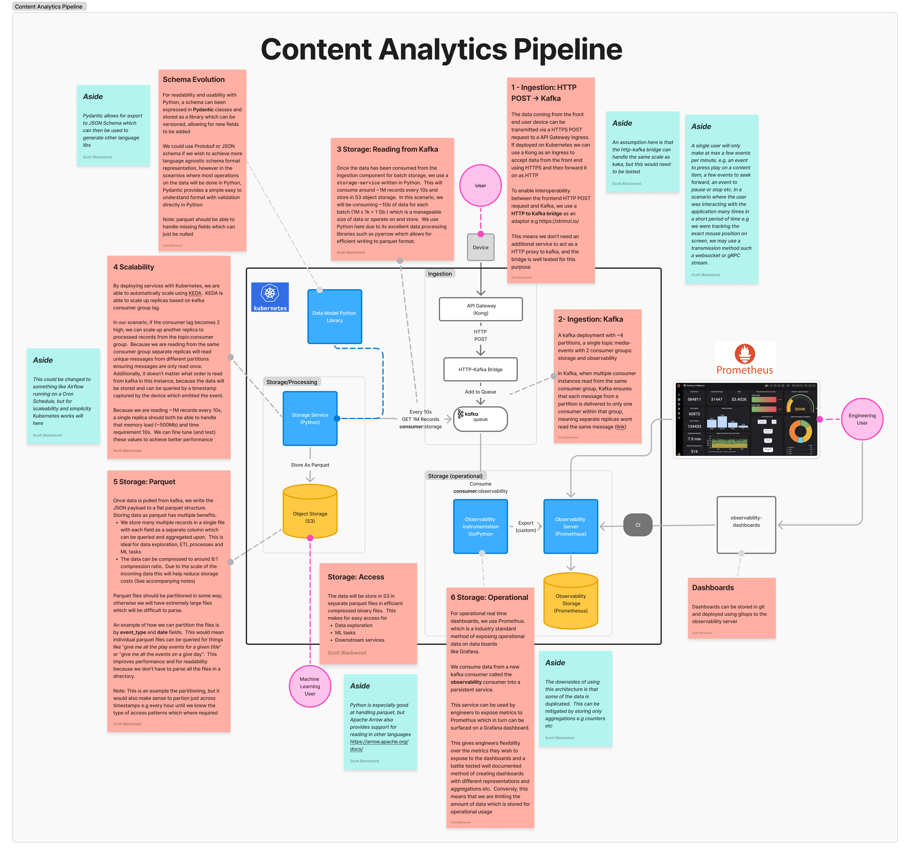

## Part 1: High-Level Architecture Design



See the [Figma Diagram](https://www.figma.com/board/77tO7NRcYo8azEseWuHhpI/Content-Analytics?node-id=26-2198&t=ao9I2QNvKoG4aGy0-1).  The diagram has details of the componetns and design decisions, but there are some more details and notes below.

### Ingestion

The system ingests data via the users device via a HTTP POST request made by the users device when a content analytic event is created. Simple HTTP REST is used here as there is no need for anything more complex. A single user will only make at max a few events per minute, e.g. an event to press play on a content item, a few events to seek forward, an event to pause or stop etc. In a scenario where the user was interacting with the application many times in a short period of time e.g we were tracking the exact mouse position on screen, we may use a transmission method such a websocket or gRPC stream.

To enable interoperability between the frontend HTTP POST request and Kafka, we use a HTTP to Kafka bridge as an adaptor e.g https://strimzi.io/ which allows us to send HTTP request data directly to the Kafka topic. We will need an ingress to allow us to accept a secure HTTPS request from the front end, which can in turn forward on to a the HTTP-Kafka bridge. For this we can use an AWS ELB and Kong as an ingress.

### Data Schema
The data payload which is delivered from the front end can contain something similar to the following format. For readability and usability with Python, the schema has been expressed in Pydantic classes. 

We could use Protobuf or JSON schema if we wish to achieve more language agnostic schema format representation, however in thescearnios where most operations on the data will be done in Python, Pydantic provides a simple easy to understand format with validation directly in Python (Note, you can export Pydantic to JSON schema. Using a schema format lets us validate data before it is added into data storage to help ensure the integrity of the data. Using a

Metadata schema version allows us to attempt to add new fields to the data and version control the versions. This way you can package the classes as a new version for each release e.g `from datamodel.1_2_0 import MediaEvent`. 

```python
class MediaEvent(BaseModel):
    # Event core fields
    event_id: str
    event_type: Literal["play", "pause", "stop"]
    timestamp: str

    # User fields
    user_id: str
    device_id: str
    ip_address: str
    content_id: str
    content_type: Literal["movie", "episode", "ad"]
    title: str
    genre: List[str]
    duration_seconds: int
    language: str
    current_timestamp: float
    schema_version: str = "1.0"
    event_source: str

    # Allow for additional fields
    model_config = {
        "extra": "allow",
    }
```

  A specific payload example might look like:

```json
{
  "event_id": "content_analytics_event__123",
  "event_type": "play", 
  "timestamp": "2025-03-25T14:30:45.123Z",
  "user_id": "user_123",
  "device_id": "web_browser_xyz",
  "session_id": "sesssion_123", 
  "ip_address": "192.168.1.1",
  "content_id": "media_123",
  "content_type": "movie",
  "title": "Mr Robot",
  "genre": ["thriller", "action"],
  "duration_seconds": 8880,
  "language": "en",
  "current_timestamp": 120.5,
  "schema_version": "1.0",
  "event_source": "web_app"
}
```

  
## Ingestion

Attempting to store 5M records per minute i.e 83k/s writes, on S3 will be difficult. For this purpose we want to buffer the data in a queue so that it can be operated on via some processing job to store the data and any pre-computed metrics. 

> S3 has a storage write limits for each prefix [1] which means we can't simply write directly from kafka to S3 per event. 

Here we use a **storage service** process which will periodically i.e every 10s we will pull ~1M records from the queue to written as a single batch into a S3 bucket prefix. This reduces the number of writes required. and also buffers the ingestion from the storage. If the storage components was inaccessiable or inoperational, the data is still stored on kafka until they are ready to be consumed. If there was no queue buffer, the messages may be lost if the processing/storage components were down.

#### Real-time Operational Dashboards

For operational real time dashboards, we use a Promethus. Promethus is an industry standard method of exposing operational data on data boards like Grafana. We can consume data from a new kafka consumer called the `observability` consumer into a persistant service in written in Go.

This service can be used by engineers to expose metrics to Promethus which in turn can be surfaced on a Grafana dashboard. The service will expose a `/metrics` endpoint which is periodically scraped by a prometheus server and its data stored in a time series database. Dashboards can be created directly on a Grafana deployment which has access to the metrics data source, or dashboard config stored in git and deployed via a Grafana operator on Kubernetes.

This gives engineers flexibility over the metrics they wish to expose to the dashboards and a battle tested well documented method of creating dashboards with different representations and aggregations etc. Conversely, this means that we are limiting the amount of data which is stored for operational usage as we will only store various aggregations and summaries of the data instead of the data in full.

The data can also be given a retention period of e.g. 60 days to reduce the amount of stored data. I have chose Go here for solid performance characteristics, in opposition to something like Python.

> [!Considerations]
> There are some downsides of using Promethus for this purposes. Firstly, there is some duplication of data in that we are already storing alot of the
> same data in parquet for the analytics operations (see [Data Storage](#Data Storage). It may be possible to reuse the parquet data and within Prometheus, however it is not a standard usage and fell out of the scope of this investigation. A guiding principle here is to not build things which have already been done and are "solved issue" - The use case for internal operational dashboards fits closely with the use case which is a industry standard in that area (and is open source)

## Storage

Once the data has been consumed from the ingestion component for batch storage, we use a `storage-service` written in Python. This will consume around ~1M records every 10s and store in S3 object storage. In this scenario, we will be consuming ~1000Mb of data for each batch (1M x 1k = 1Gb) which is a manageable size of data or operate on and store. We use Python here due to its excellent data processing libraries such as pandas and pyarrow which allows for efficient writing to parquet format.

Using parquet we can partition the data in the storage location to allow for more easy reading from disk (as redundant data is skipped when filtering) and for a more human readable data format.

Parquet format has the additional benefit of having high compression capability. The payload mentioned above will require 2.52Tb/day of storage if stored uncompressed.

Parquet will give an average 8:1 compression ratio which will allows us to greatly reduce the amount of stored data.
## Notes

### Storage Size and Costs

This payload is ~350 bytes of data
350 bytes/event x 5000000 events = 1750000000 bytes (1.75GB) per minute.
Which works out to
- 105 GB/Hr
- 2.52 TB/day

Taking a base assumption for storage costs of S3 Storage (https://aws.amazon.com/s3/pricing/)

That would work out to $0.023 per GB = ~$1800/month (2.52 TB/day × 30) if stored raw/uncompressed

> [!note] We use dollars as that is AWS standard.  

Even if this was stored as parquet at a 1:10 compression ratio we would still need to spend ~$180 a month

Storing the raw data allows us to reprocess historical data if we want add anything to the schema (which can be added without use interaction)
## References

  

1. S3 Prfix write requests per second https://docs.aws.amazon.com/AmazonS3/latest/userguide/optimizing-performance.html

2. Parquet compression ratio https://coralogix.com/blog/parquet-file-format/#:~:text=Parquet%20file%20formats%20support%20various,Parquet%20files%20from%20other%20formats.